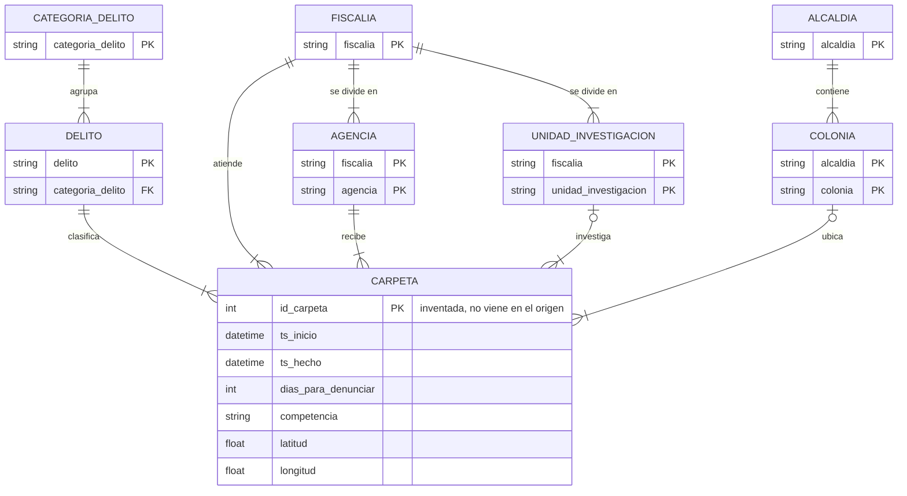

# Práctica 2 — Estadística descriptiva

La práctica pide cuatro cosas: aplicar estadística descriptiva, identificar
entidades y relaciones, trazar su diagrama y obtener métricas de datos agrupados.

Se usan las 242,392 denuncias ya limpias de la Práctica 1
(`../Practica 1/carpetas_2023_limpio.parquet`). El archivo crudo no se toca.

```
python estadistica_desc.py          # el reporte completo (queda en salida.txt)
python estadistica_desc.py --demo   # comprueba las fórmulas con ejemplos a mano
```

---

## 1. Estadística descriptiva

### Qué significa cada columna de las tablas

| nombre | qué es |
|---|---|
| registros | cuántos valores hay, sin contar los vacíos |
| media | el promedio: se suma todo y se divide entre el número de registros |
| mediana | el valor de en medio: la mitad de los datos queda abajo y la mitad arriba |
| moda | el valor que más se repite |
| cuartil 1 | el valor por debajo del cual queda el 25% de los datos |
| cuartil 3 | el valor por debajo del cual queda el 75% de los datos |
| rango entre cuartiles | cuartil 3 menos cuartil 1: el ancho donde vive la mitad de en medio |
| desviación estándar | qué tanto se alejan los datos de la media, en promedio |
| coeficiente de variación | la desviación estándar dividida entre la media, en porcentaje |
| sesgo | qué tan torcida está la distribución. 0 es simétrica; positivo es cola larga a la derecha |
| curtosis | qué tanto de la variación viene de unos pocos valores extremos. 0 es igual que una curva normal |
| fuera de Tukey | qué porcentaje de datos marcaría como raros la regla clásica de valores atípicos |

### Variables numéricas

| variable | registros | media | mediana | moda | cuartil 1 | cuartil 3 | rango entre cuartiles | desviación estándar | coef. de variación % | sesgo | curtosis | fuera de Tukey % |
| --- | --- | --- | --- | --- | --- | --- | --- | --- | --- | --- | --- | --- |
| dias_para_denunciar | 242,370 | 66.85 | 2.00 | 0 | 0 | 11 | 11 | 453.88 | 678.97 | 20.45 | 623.98 | 17.18 |
| hora_inicio | 242,392 | 14.70 | 15.23 | 13.5 | 11.75 | 19.28 | 7.53 | 5.97 | 40.63 | −0.75 | 0.02 | 1.70 |
| latitud | 228,245 | 19.3829 | 19.3859 | 19.4051 | 19.3316 | 19.4356 | 0.1041 | 0.0725 | 0.37 | −0.21 | −0.27 | 0.10 |
| longitud | 228,245 | −99.1366 | −99.1409 | −99.0942 | −99.1755 | −99.0968 | 0.0787 | 0.0625 | −0.06 | 0.06 | 0.07 | 1.17 |

`hora_inicio` es la hora del día en decimal (las 14:30 son 14.5). No viene en el
archivo limpio, se calcula al cargar.

#### La media y la mediana de `dias_para_denunciar` no se parecen

La media dice 66.85 días y la mediana dice 2. La diferencia la causan unos pocos
valores enormes, como el máximo de 23,991 días. Son casos aislados, pero jalan mucho
el promedio. La mayoría de las denuncias se levantan en pocos días.

El sesgo de 20.45 y la curtosis de 623.98 confirman lo mismo. Una curva normal tiene
0 en las dos.

Para decir cuánto tarda la gente en denunciar se usa la **mediana**. La media no
sirve para eso, aunque sí para otra cosa: multiplicada por el número de registros da
el total de días acumulados, que es carga de trabajo, no el tiempo de una persona.

#### El 17.18% de "valores atípicos" no son atípicos

La regla de Tukey es la que usa el diagrama de caja para marcar los puntos raros.
Considera raro todo lo que se salga de este rango:

```
límite inferior = cuartil 1 − 1.5 × (rango entre cuartiles)
límite superior = cuartil 3 + 1.5 × (rango entre cuartiles)
```

Con esta variable, donde el cuartil 1 es 0 y el cuartil 3 es 11:

```
rango entre cuartiles = 11 − 0 = 11
límite superior       = 11 + 1.5 × 11 = 27.5 días
```

O sea que marca como raro todo lo que pase de 27.5 días: unos 41,600 registros. Pero
denunciar 40 días después no es un error de captura, es normal. La gente tarda en
darse cuenta o en decidirse a denunciar.

El 1.5 de la regla se escogió pensando en una curva simétrica, y esta tiene un sesgo
de 20.45. Cuando un criterio marca uno de cada seis registros, el que está mal es el
criterio, no los datos.

#### El coeficiente de variación no sirve para las coordenadas

No tiene sentido buscarle significado. Las coordenadas sí son números y sí miden
distancia, pero su cero no quiere decir "nada": el 0 de longitud es Greenwich, un
punto que alguien eligió. Como el coeficiente divide entre la media, el resultado
depende de dónde pusieron ese cero y no de cómo están repartidos los delitos.

La señal de que algo anda mal está en la tabla: el de longitud sale **negativo**
(−0.06%), porque la media es negativa. Una medida de dispersión no puede ser
negativa.

Restar coordenadas sí funciona, porque una resta no cambia aunque se mueva el
origen. Por eso la dispersión que sí sirve aquí es el rango entre cuartiles:

```
19.4356 − 19.3316 = 0.1041 grados de latitud ≈ 11.6 kilómetros
```

La mitad de en medio de las denuncias cabe en una franja de 11.6 km.

La columna se deja en la tabla a propósito, con esta explicación, en lugar de
borrarla.

#### `hora_inicio`

Es la única de las cuatro que se parece a una curva normal: sesgo −0.75 y curtosis
0.02. La media (14.70) y la mediana (15.23) están a media hora de distancia.

Pero hay que cuidar qué mide: es la hora en que se **abre la carpeta**, no la hora
del delito. La moda a las 13:30 es el horario del Ministerio Público, no el horario
del crimen.

La hora del delito está en otra columna, `ts_hecho`, y en la Práctica 1 quedó
documentado que el 9.9% de esas horas dicen 12:00 en punto, porque es lo que se
captura cuando el denunciante no la recuerda.

### Variables categóricas

A estas no se les puede sacar media ni desviación estándar, porque entre sus valores
no hay distancia: "Cuauhtémoc" menos "Iztapalapa" no da ningún número. Lo que sí se
puede medir es cómo se reparten:

- **moda y su porcentaje**: cuál es el valor más común y qué tanto del total se
  lleva.
- **porcentaje de los 5 más frecuentes**: qué tan concentrada está la columna.
- **entropía**: mide qué tan repartidos están los valores. Va de 0 a 1. Es 0 si todo
  cae en una sola categoría y 1 si todas las categorías tienen la misma frecuencia.
  Es lo que sustituye a la desviación estándar cuando los valores no tienen
  distancia entre sí.

| variable | valores distintos | moda | % de la moda | % de los 5 más frecuentes | entropía |
| --- | --- | --- | --- | --- | --- |
| categoria_delito | 16 | DELITO DE BAJO IMPACTO | 87.29 | 96.97 | 0.23 |
| delito | 286 | VIOLENCIA FAMILIAR | 15.61 | 42.49 | 0.68 |
| competencia | 3 | FUERO COMUN | 96.73 | 100.00 | 0.15 |
| fiscalia | 37 | AGENCIA DE DENUNCIA DIGITAL | 17.40 | 45.79 | 0.84 |
| agencia | 133 | CEN-C | 6.32 | 24.10 | 0.86 |
| unidad_investigacion | 112 | UI-1SD | 55.04 | 78.54 | 0.42 |
| alcaldia | 16 | Cuauhtemoc | 14.61 | 53.82 | 0.93 |
| colonia | 1,579 | Centro | 2.96 | 7.90 | 0.89 |

La entropía avisa cuando casi todo cae en una sola categoría. `categoria_delito`
tiene 16 valores pero entropía 0.23, porque el 87.29% es `DELITO DE BAJO IMPACTO`:
se comporta casi como si tuviera un solo valor. `alcaldia` tiene los mismos 16
valores y entropía 0.93, o sea que sí reparte.

Esto importa para la Práctica 6: un modelo que siempre conteste
`DELITO DE BAJO IMPACTO`, sin mirar nada, acierta el 87.29%. Ese número no prueba
que haya aprendido algo.

---

## 2. Entidades y relaciones

Una **entidad** es cada "cosa" distinta que está mezclada dentro de la tabla: la
denuncia, el delito, la fiscalía, la alcaldía. La tabla es plana, pero adentro hay
varias.

Las entidades no se identificaron leyendo los nombres de las columnas, porque el
nombre puede mentir. Cada relación se planteó como una suposición que se puede
tumbar con un solo caso en contra, y se comprobó contando:

```python
df.groupby('A')['B'].nunique()
```

Eso agrupa por la columna A y cuenta cuántos valores distintos de B hay en cada
grupo. Si algún grupo tiene más de uno, entonces B no depende de A.

Buscar los casos en contra dio más información que mirar el porcentaje de aciertos.
`agencia → fiscalia` se cumple en 129 de 133 casos, y quedarse en ese 97% habría
escondido lo importante: las 4 que fallan se llaman `A`, `B`, `C` y `D`, letras que
varias fiscalías reutilizan.

### La evidencia

| se probó si A determina a B | valores de A | con un solo valor de B | con más de uno | máximo | % que cumple |
| --- | --- | --- | --- | --- | --- |
| delito → categoria_delito | 286 | 286 | 0 | 1 | 100.00 |
| delito → competencia | 286 | 162 | 124 | 2 | 56.64 |
| agencia → fiscalia | 133 | 129 | 4 | 7 | 96.99 |
| colonia → alcaldia | 1,577 | 1,351 | 226 | 6 | 85.67 |
| alcaldia → municipio_hecho | 16 | 16 | 0 | 1 | 100.00 |
| (fiscalia, unidad) → agencia | 265 | 191 | 74 | 10 | 72.08 |

**`delito → categoria_delito`.** La única que se cumple sin una sola excepción. La
categoría pertenece al delito, no a la denuncia: una vez que se sabe el delito, la
categoría ya no aporta nada nuevo. Por eso el delito se convierte en una tabla
aparte, con su categoría adentro.

**`delito → competencia`.** Falla en 124 de 286. El mismo delito sale a veces como
`FUERO COMUN` y a veces como `INCOMPETENCIA`, así que el valor no depende del
delito. `INCOMPETENCIA` (el caso le tocaba a otra autoridad) y `HECHO NO DELICTIVO`
(al revisarlo no era delito) se deciden después de revisar cada caso: son un
resultado, no una etiqueta que existiera de antes. `competencia` pertenece a la
denuncia.

**`agencia → fiscalia`.** Falla en 4 de 133, y las 4 son `A`, `B`, `C` y `D`. Hace
falta la pareja `(fiscalia, agencia)`.

**`colonia → alcaldia`.** Falla en 226 de 1,577, mismo caso. Hace falta
`(alcaldia, colonia)`.

**`alcaldia → municipio_hecho`.** Se cumple al 100%, pero eso viene de la limpieza y
no es un hallazgo: `alcaldia` solo tiene valor en las 16 alcaldías reales, así que
su municipio siempre es CDMX. La columna sí trae información, 231 municipios
distintos, pero toda está en las filas sin alcaldía, donde dice a qué municipio de
fuera corresponde el hecho. No es una entidad: es de donde salió la bandera
`fuera_cdmx`.

**`(fiscalia, unidad) → agencia`.** Falla en 74 de 265. Es la que tumbó la
suposición de la jerarquía, explicada más abajo.

### Cuando el nombre no basta para identificar

| columna | nombres distintos | combinaciones reales |
| --- | --- | --- |
| agencia | 133 | 152 con `(fiscalia, agencia)` |
| unidad_investigacion | 112 | 265 con `(fiscalia, unidad)` |
| colonia | 1,579 | 1,855 con `(alcaldia, colonia)` |

La agencia `B` existe en 6 fiscalías distintas, y 226 nombres de colonia aparecen en
más de una alcaldía. Son nombres únicos dentro de su fiscalía o su alcaldía, pero no
en toda la ciudad. Es como decir "Salón 3": no sirve si no dices de qué escuela.

Y no es un detalle menor. Si se agrupa solo por el nombre de la agencia, la `B` sale
con 5,499 denuncias, pero esa cifra no corresponde a ninguna oficina real: junta
seis lugares que no tienen nada que ver, desde secuestro hasta delitos de
funcionarios.

En las colonias se midió la distancia entre los centros de cada versión repetida, y
salieron dos casos distintos: 153 están a menos de 2 km, que es una colonia partida
por la frontera entre dos alcaldías, y 67 a más de 5 km, que son nombres repetidos
en zonas distintas. `Del Carmen` aparece en 6 alcaldías, con 34 km entre extremos.
Para agrupar da igual cuál sea: en los dos casos hace falta la alcaldía.

### La suposición que se cayó

Se pensó que era una jerarquía de tres niveles, como hospital, consultorio y doctor:
la fiscalía contiene a la agencia y la agencia a la unidad.

Los datos la tumbaron. Para que algo contenga a otra cosa, cada hijo tiene que estar
en un solo padre, y aquí no pasa:

```
88 de 152 parejas de fiscalía y agencia tienen más de una unidad
74 de 265 parejas de fiscalía y unidad aparecen en más de una agencia
```

Ninguno de los dos lados es siempre uno, así que no se contienen: se cruzan. Agencia
y unidad cuelgan las dos de la fiscalía, en paralelo, y lo que las junta es la
denuncia, porque cada fila registra en qué agencia se levantó y qué unidad la
investiga.

### No hay identificador

El archivo no trae folio ni número de carpeta. Tampoco hay filas repetidas por
completo, así que lo único que identifica cada denuncia es la fila entera, y eso no
sirve para relacionar nada. La fecha y hora de inicio tampoco alcanza: se repite en
1,209 filas.

Se agrega `id_carpeta` como identificador inventado (1, 2, 3...). Es una decisión de
modelado, no un dato del origen, y hay que generarla al cargar el archivo.

### El diagrama

Está escrito en Mermaid, que GitHub dibuja solo. Para leerlo:

- **PK** es la columna, o las columnas, que identifican cada renglón de esa entidad.
- **FK** es una columna que apunta a otra entidad.
- Los símbolos de en medio dicen cuántos de cada lado participan. El símbolo pegado
  a una entidad habla de esa entidad.

| símbolo | significa |
|---|---|
| dos rayas | exactamente uno |
| raya y pata de cuervo | uno o muchos |
| raya y círculo | cero o uno |

`CATEGORIA_DELITO ||--|{ DELITO` se lee: una categoría agrupa uno o muchos delitos,
y un delito pertenece a exactamente una categoría.



`CARPETA` está al centro porque es lo que representa cada fila: una denuncia. Las
otras siete son catálogos que la denuncia usa, y cada uno sirve para agrupar por un
criterio distinto.

Las relaciones con `COLONIA` y con `UNIDAD_INVESTIGACION` son opcionales porque hay
14,144 denuncias sin colonia y 540 sin unidad. En la Práctica 1 quedó documentado
que el hueco de la colonia no es al azar: un robo en el Metro no tiene domicilio de
dónde sacar la ubicación.

### Lo que se supuso sin poder comprobarlo

- **Una fila es una denuncia.** Sin folio no hay forma de verificar si una denuncia
  con varios delitos se partió en varias filas.
- **Una denuncia tiene un solo delito.** En la realidad puede tener varios; aquí
  viene todo en un renglón.
- **No hay documentación** de qué representa la columna `agencia`. Lo que sí se
  comprobó es que el nombre solo no sirve para identificar, y eso es cierto sin
  importar qué signifique.

---

## 3. Métricas de datos agrupados

Agrupar es cambiar cada dato por el centro del intervalo donde cae, y recalcular
todo desde la tabla de frecuencias. Se pierde información a propósito: si un
intervalo va de 60 a 70 y adentro había un 62 y un 65, los dos pasan a valer 65 y el
promedio sube.

Cada intervalo (o **clase**) se describe así:

| nombre | qué es |
|---|---|
| límite inferior | dónde empieza |
| límite superior | dónde termina |
| marca de clase | el centro: el promedio de los dos límites. Es el valor que se le asigna a todos los datos de esa clase |
| amplitud | el ancho: límite superior menos límite inferior |
| frecuencia | cuántos datos cayeron ahí |
| frecuencia acumulada | cuántos datos hay en esa clase y en todas las anteriores |

Las fórmulas:

```
media = (suma de: frecuencia × marca de clase) / total de datos

mediana = límite inferior + ((mitad del total − frecuencia acumulada anterior)
                             / frecuencia de esa clase) × amplitud

moda = límite inferior + (d1 / (d1 + d2)) × amplitud

varianza = (suma de: frecuencia × (marca de clase − media)²) / (total − 1)
```

Para la mediana se busca primero en qué clase cae la mitad del total, y luego se
reparte proporcionalmente dentro de esa clase. Los cuartiles se calculan igual,
cambiando "la mitad" por "un cuarto" o "tres cuartos".

Para la moda, `d1` es la frecuencia de la clase más alta menos la de la clase
anterior, y `d2` es esa misma frecuencia menos la de la siguiente. Se usa así, y no
nada más el centro de la clase más alta, porque toma en cuenta hacia qué lado se
recarga.

`python estadistica_desc.py --demo` comprueba las cuatro fórmulas contra una tabla
resuelta a mano.

### En cuántas clases partir

Hay tres reglas comunes y no dan lo mismo:

- **Sturges**: 1 más el logaritmo base 2 del número de registros.
- **Raíz**: la raíz cuadrada del número de registros.
- **Freedman-Diaconis**: parte del rango entre cuartiles, así que sí toma en cuenta
  cómo están repartidos los datos y no solo cuántos son.

| variable | Sturges | raíz | Freedman-Diaconis |
| --- | --- | --- | --- |
| dias_para_denunciar | 19 | 493 | 67,992 |
| hora_inicio | 19 | 493 | 100 |
| latitud | 19 | 478 | 134 |
| longitud | 19 | 478 | 153 |

Sturges da 19 para las cuatro variables, porque solo depende de cuántos registros
hay y las cuatro tienen los mismos 242,392. No mira cómo están repartidos los datos.

Freedman-Diaconis sí mira la forma, y por eso pide 67,992 clases para
`dias_para_denunciar`: el rango entre cuartiles es de 11 días, pero el rango
completo llega a 23,991, así que propone clases de 0.35 días. Es correcto y es
inútil, y ya avisa de lo que viene.

Se usa Sturges, que es la del curso, y en las otras tres variables da un número
razonable.

### Cuánto cuesta agrupar

Cada métrica se calculó de dos formas: desde la tabla de frecuencias y directo sobre
los 242,392 datos. La tabla muestra qué tanto se equivoca la primera, con 19 clases:

| variable | media | mediana | varianza | desviación estándar | cuartil 3 |
| --- | --- | --- | --- | --- | --- |
| latitud | 0.0006% | 0.0002% | 0.41% | 0.20% | 0.0005% |
| longitud | 0.0001% | 0.0005% | 0.93% | 0.46% | 0.0004% |
| hora_inicio | 0.0072% | 0.053% | 0.39% | 0.20% | 0.025% |
| dias_para_denunciar | **887.8%** | **31,806%** | 22.9% | 12.2% | **8,602%** |

En tres de las cuatro, agrupar sale casi gratis: la media de la latitud se equivoca
hasta el sexto decimal. Es porque los datos están repartidos parejo alrededor del
centro de cada clase, así que los errores se cancelan entre sí: unos quedan por
arriba y otros por abajo.

La varianza es la que más sufre, hasta 0.93%, y siempre se queda por debajo del
valor real, porque agrupar borra la variación que había dentro de cada clase.

### Por qué `dias_para_denunciar` se rompe

Con 19 clases del mismo ancho (1,262.68 días cada una):

| clase | rango en días | registros | % | % acumulado |
| --- | --- | --- | --- | --- |
| 1 | 0 a 1,263 | 239,792 | 98.94 | 98.94 |
| 2 | 1,263 a 2,525 | 1,460 | 0.60 | 99.54 |
| 3 | 2,525 a 3,788 | 518 | 0.21 | 99.75 |
| 4 a 18 | 3,788 a 22,728 | 599 | 0.25 | 100.00 |
| 19 | 22,728 a 23,991 | 1 | 0.00 | 100.00 |

Los cortes salen de partir el rango completo en 19 partes iguales:
`(23,991 − 0) / 19 = 1,262.68`.

Como las clases se estiran hasta el valor más alto, ese valor pesa muchísimo más de
lo que le toca: un solo registro de 65 años decide el ancho de las 19 clases, y las
otras 18 quedan casi vacías. La primera clase se lleva el 98.94% de los datos, así
que a 239,792 registros se les asigna la misma marca de 631 días, cuando la mediana
real es 2.

Los errores de la mediana y del cuartil 3 se ven peor de lo que son. Ese 31,806% es
638 días contra 2, y cualquier error dividido entre un número tan chico se dispara.
El cuartil 1 y la moda ni siquiera tienen porcentaje, porque su valor exacto es 0 y
no se puede dividir entre cero. Es otra razón para no mirar solo el porcentaje de
error.

### Tres variaciones probadas

Se reportan las tres porque cada una arregla una parte y rompe otra.

**A. Subir el número de clases**

| clases | error en la media | error en la mediana | error en la desviación estándar |
| --- | --- | --- | --- |
| 5 | 3,505% | 120,054% | 32.9% |
| 19 | 888% | 31,806% | 12.2% |
| 60 | 262% | 10,182% | 4.2% |
| 120 | 124% | 5,195% | 2.2% |
| 500 | 25.3% | 1,277% | 0.5% |

El error baja siempre, pero aun con 500 clases la media se equivoca en un 25%, o sea
que sigue diciendo el doble de lo real. Subir el número de clases no arregla el
problema, porque el problema no es cuántas clases hay sino que la variable tiene una
cola que estira los cortes.

**B. Clases de distinto ancho**, con cortes en plazos que sí significan algo: el
mismo día, tres días, la semana, la quincena, el mes, el trimestre y el año.

| rango en días | registros | % |
| --- | --- | --- |
| 0 a 1 | 118,390 | 48.85 |
| 1 a 3 | 31,949 | 13.18 |
| 3 a 7 | 22,634 | 9.34 |
| 7 a 15 | 16,001 | 6.60 |
| 15 a 30 | 13,882 | 5.73 |
| 30 a 90 | 17,137 | 7.07 |
| 90 a 365 | 14,385 | 5.94 |
| 365 a 23,991 | 7,992 | 3.30 |

| métrica | agrupada | exacta | error |
| --- | --- | --- | --- |
| media | 422.30 | 66.85 | 531.72% |
| mediana | 1.17 | 2.00 | 41.25% |
| cuartil 3 | 11.40 | 11.00 | **3.65%** |
| varianza | 4,715,273 | 206,011 | 2,188% |

Ahora el reparto quedó parejo y los cuartiles salen muy bien: el cuartil 3 se
equivoca solo 3.65%. Pero la media y la varianza empeoran, y la culpa es de la
última clase: va de 365 a 23,991 días, tiene 7,992 registros y su centro queda en
12,178 días, cuando en realidad casi todos están cerca del inicio.

La conclusión no es que unas clases sean mejores. Es que los cuartiles aguantan una
tabla mal hecha y la media no: a los cuartiles les basta con que los cortes sean
finos donde está la mayoría de los datos, mientras que la media suma todos los
centros, incluido el del intervalo absurdo.

**C. Cambiar de escala.** En vez de agrupar los días tal cual, se agrupa el
logaritmo base 10 de (1 + días). El "más 1" es porque el logaritmo de 0 no existe y
sí hay denuncias con 0 días. Con las mismas 19 clases:

| métrica | agrupada | exacta | error |
| --- | --- | --- | --- |
| media | 0.7521 | 0.6991 | 7.58% |
| mediana | 0.4812 | 0.4771 | 0.86% |
| desviación estándar | 0.7464 | 0.7814 | 4.48% |
| cuartil 3 | 1.0810 | 1.0792 | 0.17% |

En escala logarítmica la variable ya no tiene cola larga, así que las 19 clases se
reparten los datos en lugar de que una sola se lleve el 99%. El error de la media
baja de 887.8% a 7.58%.

El precio: al deshacer el logaritmo, la media deja de ser la media de siempre y se
convierte en media geométrica, que da 4.0 días contra los 66.85 de la media normal.
Sirve para reportar el rezago típico y no sirve para estimar carga de trabajo.

### Conclusión

Con 242 mil filas en un archivo nadie necesita agrupar. El ejercicio sirve para
medir cuánto se pierde, que es justo lo que pasa cuando el dato llega ya tabulado.

Comparando las tres variaciones se ve que el número de clases importa mucho menos
que si la variable está en la escala correcta. Sturges con la escala buena le gana a
Freedman-Diaconis con la escala mala.

---

## 4. Descriptivos agrupados por entidad

Ya con las entidades identificadas, la estadística por grupo es la que responde
algo. Días para denunciar, por categoría de delito:

| categoría | registros | mediana | media | 90% denuncia en |
| --- | --- | --- | --- | --- |
| VIOLACIÓN | 2,845 | 7 | 632.5 | 1,677 días |
| DELITO DE BAJO IMPACTO | 211,579 | 2 | 65.8 | 89 |
| ROBO A PASAJERO EN EL METRO | 1,362 | 2 | 13.1 | 17 |
| ROBO A NEGOCIO CON VIOLENCIA | 1,993 | 1 | 15.7 | 15 |
| ROBO A TRANSEÚNTE EN VÍA PÚBLICA | 8,855 | 1 | 14.8 | 9 |
| ROBO DE VEHÍCULO | 6,662 | 1 | 16.2 | 10 |
| SECUESTRO | 20 | 0.5 | 21.4 | 9 |
| HOMICIDIO DOLOSO | 887 | 0 | 14.9 | 1 |
| LESIONES POR DISPARO DE ARMA DE FUEGO | 811 | 0 | 2.4 | 1 |
| HECHO NO DELICTIVO | 5,102 | 0 | 28.9 | 12 |

El rango de medianas va de 0 a 7 días y el orden no es casual. Los delitos con
mediana 0 son los que llegan por reporte de emergencia: en un homicidio la carpeta
la abre la autoridad, no la víctima. La violación es el otro extremo, con mediana de
7 días y un 10% de casos que tarda más de cuatro años: ahí la carpeta solo se abre
si la víctima decide denunciar.

En el punto 1, `dias_para_denunciar` parecía nada más una variable con una cola
rara. Agrupada por entidad, la cola deja de ser ruido: es la diferencia entre un
delito que reporta la autoridad y uno que reporta la víctima.
