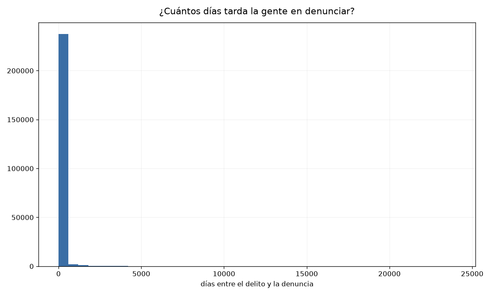
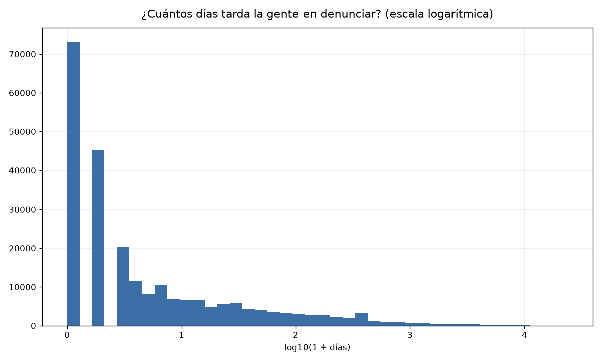
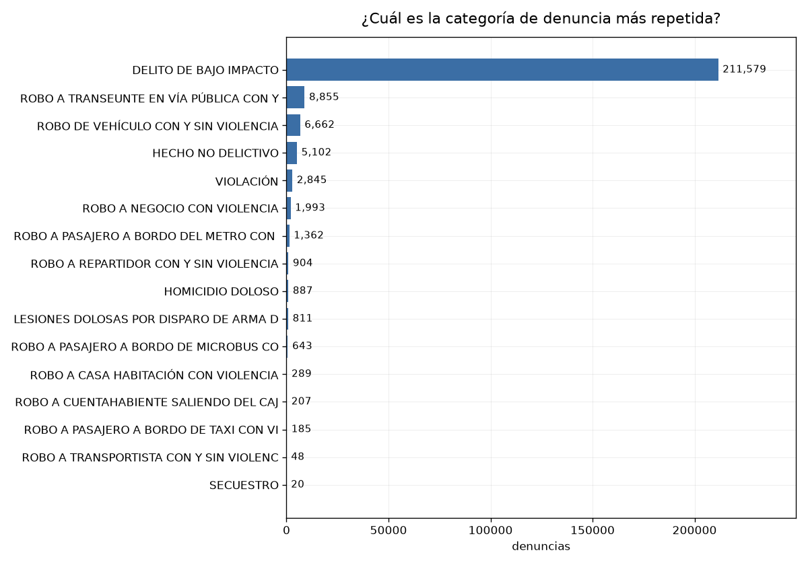
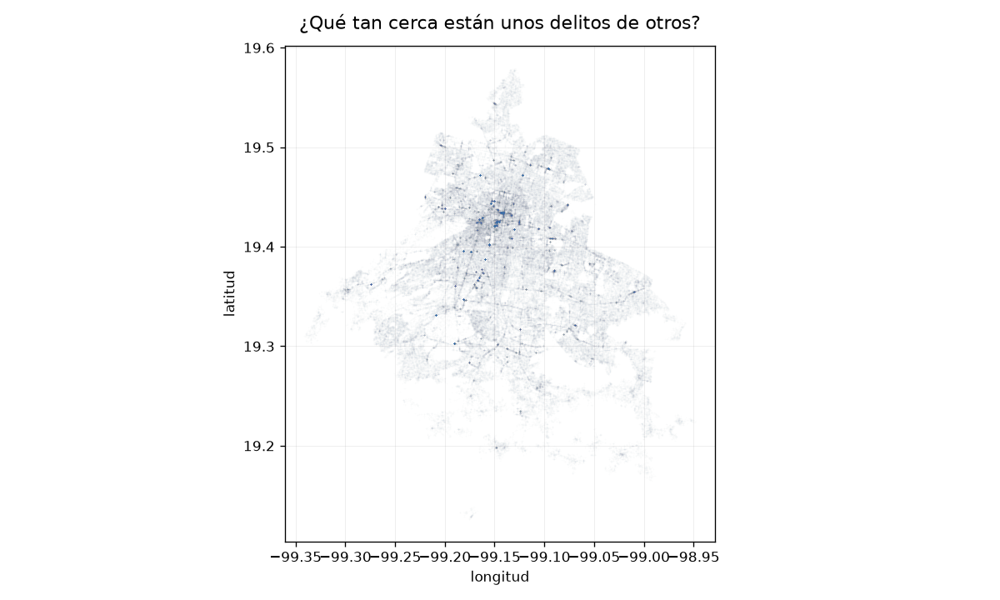
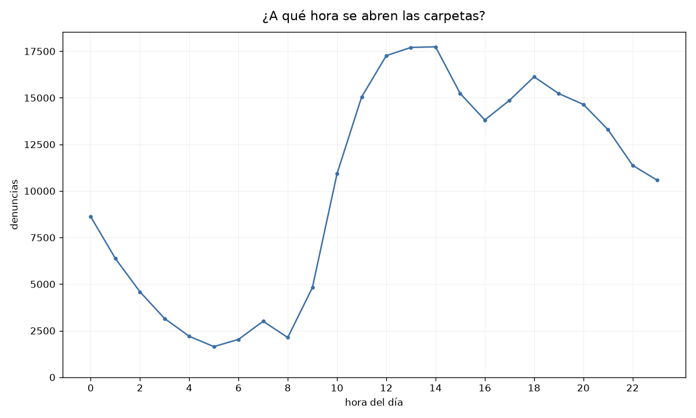
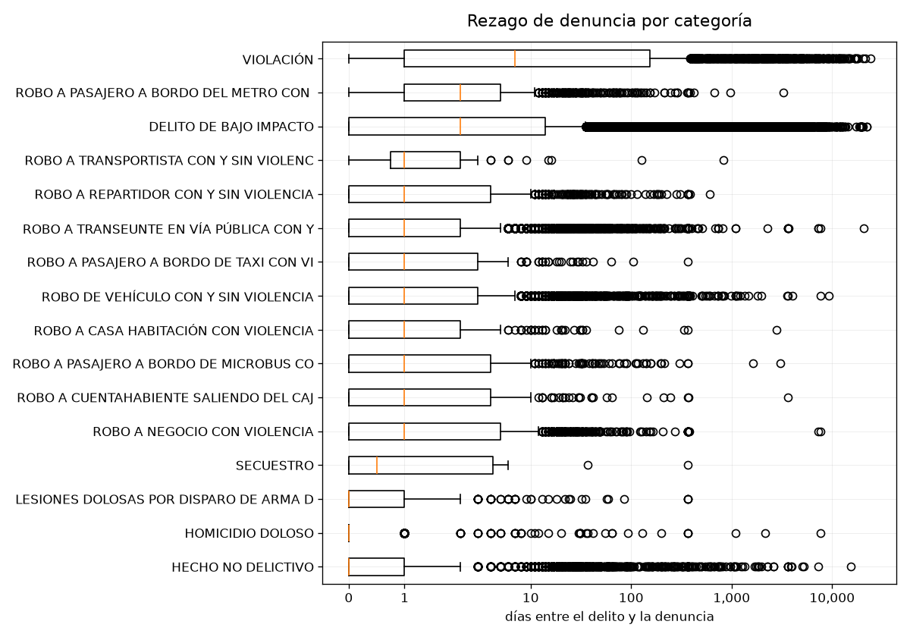

# Práctica 3 — Visualización

La práctica pide al menos 5 tipos de gráfica, generadas con ciclos o automatización.

Se usan las mismas 242,392 denuncias limpias de la Práctica 1
(`../Practica 1/carpetas_2023_limpio.parquet`).

```
python graficas.py          # genera los PNG en graficas/
python graficas.py --demo   # comprueba que cada tipo de la lista se dibuja
```

Necesita `matplotlib`. Son **5 tipos distintos** en **6 gráficas**: el histograma
aparece dos veces, en escala normal y logarítmica, para comparar.

## Por qué un ciclo y no seis bloques de código

Las gráficas no se escribieron una por una. La lista `GRAFICAS` dice qué dibujar y
un solo ciclo las genera todas. Agregar una gráfica es agregar un renglón a la
lista, no copiar y pegar veinte líneas.

La ventaja se notó al hacerlas: la cuadrícula, el tamaño del título y el guardado
están escritos una sola vez, así que al cambiarlos se aplicaron a las seis al mismo
tiempo. Si estuvieran copiadas, habría que tocar seis lugares y alguno quedaría
distinto.

El ciclo usa un campo `tipo` en cada entrada de la lista, y un `if` decide qué
función de matplotlib usar. Se escogió así en lugar de guardar funciones dentro de
la lista porque se lee más fácil, aunque el `if` crezca con cada tipo nuevo.

Así se ve una entrada de la lista y el ciclo completo:

```python
GRAFICAS = [
    {"archivo": "1-histograma", "tipo": "histograma",
     "x": "dias_para_denunciar", "log": False,
     "titulo": "¿Cuántos días tarda la gente en denunciar?"},
    ...
]

for g in GRAFICAS:
    fig, ax = plt.subplots(...)
    dibujar(ax, df, g)        # el if que decide el tipo vive aquí adentro
    ax.set_title(g["titulo"])
    fig.savefig(...)
```

---

## 1. ¿Cuántos días tarda la gente en denunciar?

**Tipo: histograma.**



Esta gráfica no se ve, y por eso se queda. Es la prueba del problema: casi todas las
denuncias caben en la primera barra mientras el eje se estira 20,000 días para
acomodar unos pocos casos. Si solo dejara la logarítmica, se vería una distribución
bonita y nadie sabría que hubo que transformarla para llegar ahí.

Es lo mismo que pasó en la Práctica 2 con las clases de igual amplitud: el 98.94% de
los datos cayó en la primera clase.

## 2. La misma, en escala logarítmica

**Tipo: histograma (variación).**



Aquí sí se ve la forma. La primera barra son 73,149 denuncias levantadas el mismo
día, y de ahí baja de forma pareja hasta los 23,991 días, sin los huecos que dejaba
la escala normal. Cada escalón de tiempo tiene menos denuncias que el anterior, y eso
en la gráfica 1 era imposible de notar.

Se usa `log10(1 + días)` y no `log10(días)` porque hay 118,390 denuncias con 0 días y
el logaritmo de 0 no existe. El "más 1" recorre todo para que el cero siga siendo un
valor válido.

## 3. ¿Cuál es la categoría de denuncia más repetida?

**Tipo: barras horizontales.**



211,579 contra 20. Es la imagen de lo que en la Práctica 2 se midió con la entropía
de 0.23: dieciséis categorías, pero una se lleva casi todo.

A cada barra se le puso su conteo al final porque doce de las dieciséis son tan
chicas que no alcanzan a dibujarse. Sin el número, `SECUESTRO` y
`ROBO A TRANSPORTISTA` serían espacio en blanco.

**No se usó escala logarítmica aquí, aunque sí en la gráfica 6.** Son dos casos
distintos. En el boxplot, la cola tapaba el hallazgo: sin log no se veía ni una sola
caja y la comparación entre categorías, que era el objetivo, desaparecía. Aquí pasa
lo contrario: el desbalance **es** el hallazgo y se ve perfecto. Lo único que faltaba
era el detalle de las doce chicas, y eso lo resolvieron los conteos sin tocar la
escala.

Si se pusiera log, las dieciséis barras quedarían de tamaño parecido y quien viera la
gráfica de reojo pensaría que están repartidas. Sería esconder justo lo que se
descubrió.

## 4. ¿Qué tan cerca están unos delitos de otros?

**Tipo: dispersión.**



Sin ningún mapa de fondo, los puntos solos dibujan la silueta de la ciudad. Se
distinguen las avenidas como líneas y hay una mancha oscura en el Centro.

Son 228,245 puntos y en negro sólido serían una mancha uniforme. Con opacidad 0.01
cada punto casi no se ve, pero donde se encima mucha gente sale oscuro, así que el
resultado es un mapa de densidad.

Para la Práctica 7 esto ya avisa algo: no hay grupos separados con espacio vacío
entre ellos, es una sola mancha continua que nada más cambia de intensidad. El
K-Means va a partirla en pedazos de todos modos, porque siempre devuelve los grupos
que se le pidan, pero esos cortes van a ser decisiones del algoritmo y no fronteras
que existan en los datos.

## 5. ¿A qué hora se abren las carpetas?

**Tipo: línea.**



Valle a las 5 de la mañana con 1,644 denuncias, subida desde las 9, máximo a las 14
con 17,738, bajón a las 16 y repunte a las 18.

Es la hora en que se **abre la carpeta**, no la hora del delito. Lo que se ve es el
horario del Ministerio Público.

Las 8,621 denuncias de la medianoche sí son reales: solo 5 están a las 00:00:00
exactas y los minutos se reparten parejo. Es distinto del 12:00:00 de la Práctica 1,
donde 23,988 registros caían en el mismo segundo porque es lo que se captura cuando
nadie recuerda la hora.

## 6. Rezago de denuncia por categoría

**Tipo: caja y bigotes.**



`HOMICIDIO DOLOSO` tiene la caja pegada al 0 y `VIOLACIÓN` es la única cuya caja
empieza donde las demás ya terminaron. Es la conclusión de la sección 4 de la
Práctica 2, pero de un vistazo en vez de comparando números en una tabla.

Con el eje normal las cajas quedaban aplastadas en un pixel, porque los puntos
atípicos estiran el eje hasta 23,991 días y lo único visible era una pared de
círculos. Se usó `symlog` y no `log` porque hay denuncias con 0 días.

---

## Lo que costó que se vieran

Tres de las seis no servían en el primer intento: el histograma quedaba aplastado por
la cola, la dispersión era una mancha negra y el boxplot no mostraba ni una caja.

La causa es la misma en las tres: unos pocos valores extremos, o demasiados puntos
encimados, hacen que el resto desaparezca. Y las tres se arreglaron sin tocar los
datos, solo cambiando cómo se dibujan.
