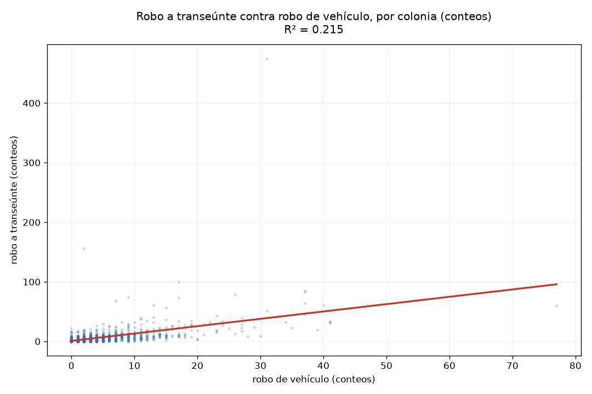
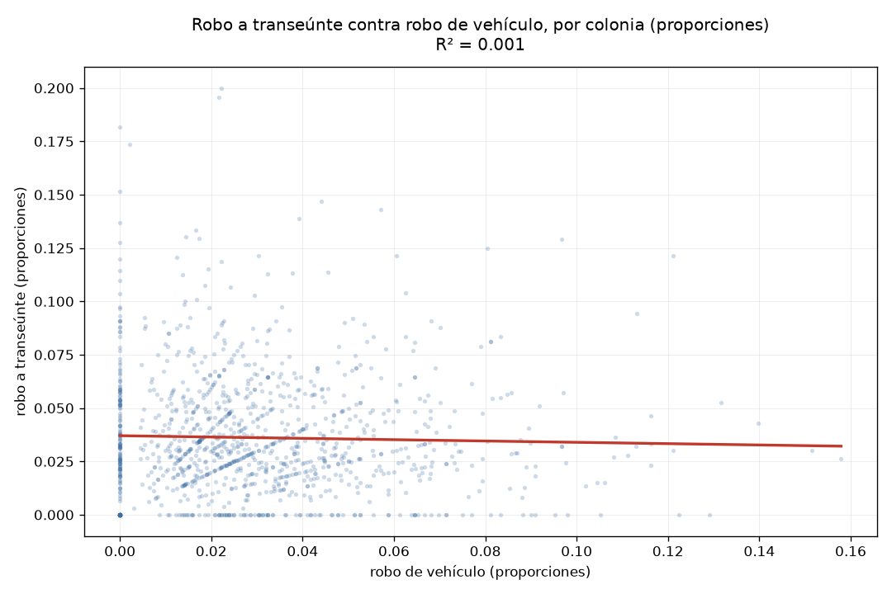

# Práctica 5 — Modelo lineal, correlación y R²

```
python modelo_lineal.py          # el reporte completo (queda en salida.txt)
python modelo_lineal.py --demo   # comprueba las fórmulas con casos conocidos
```

Usa `scipy` y `matplotlib`, que ya estaban. No hizo falta `sklearn`: una regresión
simple son tres líneas con `scipy.stats.linregress`, y `R² = r²`.

## El problema de arranque

Un modelo lineal necesita dos variables numéricas donde una explique a la otra. Las
del dataset no sirven: todas correlacionan en cero entre sí.

| | dias_para_denunciar | hora_inicio | latitud | longitud |
|---|---|---|---|---|
| dias_para_denunciar | 1.000 | −0.003 | 0.005 | −0.009 |
| hora_inicio | −0.003 | 1.000 | 0.015 | 0.000 |
| latitud | 0.005 | 0.015 | 1.000 | −0.124 |
| longitud | −0.009 | 0.000 | −0.124 | 1.000 |

La más alta es −0.124 entre latitud y longitud, y eso solo es la forma de la ciudad.

Ninguna pareja de columnas numéricas sirve para un modelo lineal: todas correlacionan
en cero. Así que se cambió la unidad de análisis. En vez de que cada fila sea una
denuncia, cada fila pasa a ser una colonia, con cuántos delitos de cada tipo tuvo
durante el año.

Eso convierte columnas que no se relacionaban en variables que sí pueden hacerlo: ya
no se pregunta si la hora de una denuncia explica sus días de rezago, sino si un tipo
de delito en una colonia explica otro.

Las colonias se agrupan por la pareja `(alcaldia, colonia)` y no por el nombre solo,
por lo que se encontró en la Práctica 2: 226 nombres de colonia se repiten en más de
una alcaldía, y agrupar por nombre junta lugares que están a 34 km de distancia.

## 1. La unidad de análisis

Cada colonia es un punto. Se incluyen las que tienen al menos 30 denuncias.

```
1,204 colonias
221,489 denuncias cubiertas

bajo impacto      195,163   (88.11%)
robo a transeúnte   8,370   ( 3.78%)
robo de vehículo    5,874   ( 2.65%)
```

## 2. Correlación: conteos contra proporciones

Se midió de dos formas. En **conteos**, cuántos delitos de cada tipo tuvo la colonia.
En **proporciones**, qué porcentaje de las denuncias de esa colonia es cada tipo.

**Conteos:**

| | bajo impacto | transeúnte | vehículo |
|---|---|---|---|
| bajo impacto | 1.000 | 0.842 | 0.642 |
| transeúnte | 0.842 | 1.000 | **0.464** |
| vehículo | 0.642 | 0.464 | 1.000 |

**Proporciones:**

| | bajo impacto | transeúnte | vehículo |
|---|---|---|---|
| bajo impacto | 1.000 | −0.560 | −0.516 |
| transeúnte | −0.560 | 1.000 | **−0.027** |
| vehículo | −0.516 | −0.027 | 1.000 |

Todas las correlaciones no solo bajan: **cambian de signo**.

En conteos todo correlaciona positivo y fuerte. En proporciones, todo se cae y cambia
de signo.

La explicación es el tamaño de la colonia. Una colonia grande tiene más robos a
transeúnte **y** más robos de vehículo, simplemente porque tiene más de todo. Al
graficar un tipo contra otro sale una línea bonita, pero esa línea no dice que un
delito cause al otro: dice que los dos los causa el tamaño.

Eso es una variable de confusión, y es el ejemplo de libro de que correlación no
implica causalidad. Aquí salió con datos propios en lugar de un ejemplo inventado.

Al pasar a proporciones se quita el tamaño, porque cada conteo se divide entre el
total de su colonia. Y al quitarlo, las correlaciones se desploman: la de transeúnte
contra vehículo pasa de 0.464 a −0.027, o sea que desaparece.

### Una advertencia sobre las correlaciones negativas

Las correlaciones negativas de la tabla de proporciones hay que leerlas con cuidado,
porque en buena parte son aritmética.

Las proporciones de una colonia suman 100%, y `DELITO DE BAJO IMPACTO` se lleva el
88% de todas las denuncias. Cuando su proporción sube, por fuerza baja la de todo lo
demás, sin que eso diga nada del crimen. Por eso los −0.560 y −0.516 no se pueden
reportar como "donde hay más delitos menores hay menos robo a transeúnte".

El par limpio es transeúnte contra vehículo. Entre los dos no llegan al 7% del total,
así que la restricción de sumar 100% casi no les pega y su −0.027 sí se puede leer.
Por eso ese es el par que se modela.

## 3. El modelo lineal

Se modela `robo a transeúnte ~ robo de vehículo`, en las dos versiones.

**Conteos:**

```
pendiente       1.233
intersección    0.937
r               0.464
R²              0.215
p               3.2 × 10⁻⁶⁵   (prácticamente cero)
n               1,204
```



**Proporciones:**

```
pendiente      -0.031
intersección    0.037
r              -0.027
R²              0.001
p               0.343
n               1,204
```



En la de conteos la recta sube, pero la nube está amontonada en la esquina inferior
izquierda y unos pocos puntos lejanos la jalan. El R² de 0.215 quiere decir que el
modelo explica el 21.5% de la variación; el otro 78.5% queda sin explicar.

En la de proporciones la recta es casi horizontal y la nube no tiene dirección. El R²
de 0.001 quiere decir que el modelo no explica prácticamente nada.

**El modelo que se reporta como principal es el de proporciones**, aunque su R² sea
peor. El de conteos tiene mejor número pero está midiendo el tamaño de la colonia,
que ya se sabía. El de proporciones contesta la pregunta que de verdad interesa, que
es si una colonia con mucho robo de autos también tiene mucho robo a peatones, y la
respuesta es que no.

Explicar por qué un modelo no funciona vale más que forzar uno que sí.

### El p-value de 0.343

En la Práctica 4, con 242,370 filas, todo salía significativo: hasta dos grupos con
la misma mediana exacta daban p = 0.00008. Aquí pasa lo contrario, con 1,204 puntos
el p no alcanza ni el 0.05.

1,204 colonias no son una muestra chica. Si hubiera cualquier relación entre los dos
tipos de delito, aunque fuera mínima, una muestra de ese tamaño tendría buena
oportunidad de detectarla. En la Práctica 4 se vio justo lo contrario: con 242,370
filas, el p-value marcaba como significativos hasta pares con la misma mediana
exacta.

Que aquí no alcance ni el 0.05 es más fuerte que un "no sabemos". No es que falten
datos para decidir: es que con los datos que hay, no hay nada que encontrar.

## 4. Qué tanto depende el modelo de unos pocos puntos

La recta se calcula minimizando las distancias **al cuadrado**, así que un punto
lejano pesa muchísimo más que uno cercano: uno a 2 unidades aporta 4, uno a 20
aporta 400.

Se volvió a ajustar quitando los extremos, para ver de cuánto dependía el resultado:

| caso | n | R² | pendiente |
|---|---|---|---|
| todas las colonias | 1,204 | 0.215 | 1.233 |
| sin el top 1 de vehículo | 1,203 | 0.213 | 1.290 |
| sin el top 3 de vehículo | 1,201 | 0.208 | 1.311 |
| sin el top 1 de transeúnte | 1,203 | **0.366** | 1.003 |
| sin el top 3 de ambos ejes | 1,198 | **0.436** | 1.023 |

Las colonias extremas de cada eje:

| colonia | total | vehículo | transeúnte |
|---|---|---|---|
| Iztacalco / Agrícola Oriental | 2,017 | **77** | 60 |
| Iztapalapa / Desarrollo Urbano Quetzalcóatl | 800 | 44 | 55 |
| **Cuauhtémoc / Centro** | 6,752 | 31 | **475** |
| Venustiano Carranza / Zona Centro | 899 | 2 | 156 |

El resultado es al revés de lo que se esperaría. Quitar el punto más alejado en el eje
X, que es Agrícola Oriental con 77 robos de vehículo, casi no movió el R². Quitar la
colonia Centro lo subió de 0.215 a 0.366, y quitar los tres extremos de ambos ejes lo
llevó a 0.436, el doble del original.

La diferencia está en dónde cae cada punto respecto a la recta. Agrícola Oriental está
lejos en el eje X pero cerca de la línea, así que el modelo ya le atinaba. El Centro
tiene un valor normal en el eje X pero está lejísimos de la línea hacia arriba, y el
modelo le falla por más de 400 denuncias. Como las distancias se elevan al cuadrado,
ese error pesa enormemente.

Lo que hace distinto al Centro es su mezcla: 475 robos a peatones contra 31 de
vehículo, cuando la segunda colonia más alta en robo a transeúnte tiene 156. Ahí hay
muchísima más gente caminando y proporcionalmente menos coches estacionados, así que
su perfil de delitos no se parece al de ninguna otra colonia.

Se reporta el modelo con las 1,204 colonias, sin quitar nada. La tabla de arriba queda
como explicación de qué pasaría si se quitaran, no como el resultado.

Quitar datos hasta que el modelo se vea bien es trampa. Y el Centro no es un error de
captura ni un caso imposible: es una colonia real con 6,752 denuncias reales. Que no
encaje en la recta es información sobre el modelo, no un defecto de los datos.

## 5. Conclusión

La práctica contestó que **no hay relación lineal** entre el robo a transeúnte y el
robo de vehículo de una colonia, una vez que se descuenta el tamaño. La correlación
aparente de 0.464 en conteos era el tamaño disfrazado.

Lo que sí se encontró es más útil que el modelo: que el tamaño de la colonia es una
variable de confusión que contamina cualquier comparación entre conteos crudos, y que
la colonia Centro tiene un perfil de delitos que no se parece a ninguna otra.

Para la Práctica 7, el K-Means sobre colonias va a tener el mismo problema: si se
agrupa por conteos, los grupos van a salir por tamaño y no por tipo de delito.
